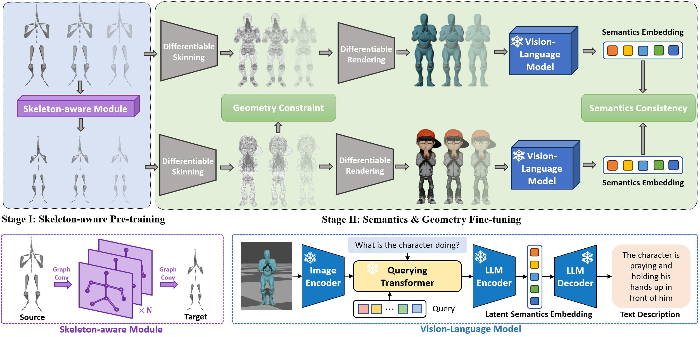

# Semantic-Motion-Retargeting
Code of [CVPR 2024] "Semantics-aware Motion Retargeting with Vision-Language Models" 

<a href='https://sites.google.com/view/smtnet'></a>




## Environment
```bash
conda create -f environment.yaml
```
Add extra dependence in libs
```bash 
cd libs/PyMo && pip install -e .
cd ../sdf && python setup.py install --user
```

## Download Data & Pre-trained Models
Training data:

- Firstly, create an account on the Mixamo website.

- Next, download the fbx animation files for each character folder in ./datasets/Mixamo/train/. The animation list can be refered to NKN. we collect 1952 non-overlapping motion sequences for training.

- Once the fbx files have been downloaded, run the following blender script to convert them into BVH files:
```bash
python dataset/scripts/fbx2bvh.py
```
- Extract shape aware data and save it in a folder named fbx under folds of each character
```bash
python dataset/scripts/fbx2data.py
```
Test && Finetune data:

- Follow the datalist in our paper

## Inference
```bash
python inference.py
```
## Train && Fine-tuning
For geometry fine-tuning, edit source and target skeleton in config files
```bash
python train.py
python finetune.py 
```
## Visualization
```bash
cd visualization
blender -P visualize.py -- --render_engine eevee\
                        --bvh_list  {bvh_file1} {bvh_file2} ...\
                        --fbx_list  {fbx_file1} {fbx_file1} ...\
                        --frame_end 60 --fps 30
```

## Citation

```
@article{zhang2023semantic,
  title={Semantics-aware Motion Retargeting with Vision-Language Models},
  author={Haodong Zhang and ZhiKe Chen and Haocheng Xu and Lei Hao and Xiaofei Wu and Songcen Xu and Zhensong Zhang and Yue Wang and Rong Xiong},
  booktitle={Proceedings of the IEEE/CVF Conference on Computer Vision and Pattern Recognition (CVPR)},
  year={2024}
}
```
